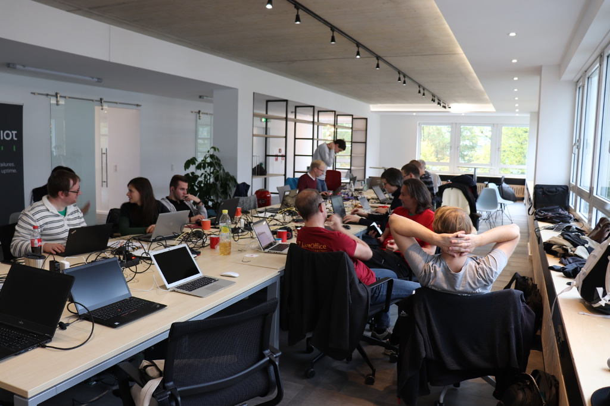
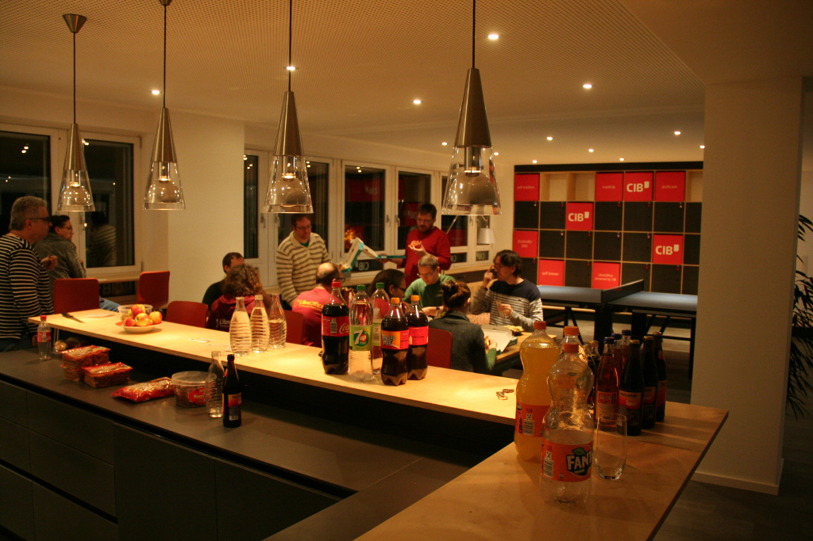

## LibreOffice Hackfest Munich

The past month (end of October) I participated at the [LibreOffice Hackfest in Munich, Germany](https://wiki.documentfoundation.org/Hackfest/Muenchen2018). 

After the [LibreOffice Conference](https://libocon.org) we organized in September, the [Open Labs](https://openlabs.cc) community had a follow-up call with LibreOffice developers about future contributions and meetings. One of the ideas [Bjorn](https://skyfromme.wordpress.com/) proposed, was to create a team of contributors that want to learn and contribute to the core code of LibreOffice.

This idea got a positive feedback from the community and now we have a group of people getting started C++ and learning how to contribute.

[Izabela Bakollari](https://twitter.com/IzabelBakollari/) and I attended the Hackfest in Munich hosted by [modulE](https://module.cib.de/) powered by [CIB](https://cib.de/).

On the first day, we started by introducing ourselves and what we would work on during the weekend. I discussed with Heiko and others about some UX tickets and the idea of separating the LibreOffice and The Document Foundation branding from each other. 

In the evening I got to [cook some delicious pasta](https://mobile.twitter.com/floeff/status/1055909904693780480) (Penne all'arrabbiata & Fusilli radicchio and gorgonzola) together with Marina and everyone seemed to have enjoyed the food (and the beer too).

The next day (Saturday) was a bit more intensive. I started to prototype some ideas I had in mind about the branding for The Document Foundation. Unfortunately, I couldn't work that much because I was behind with my personal projects too. We had some interesing discussions on future local events and more.

This second day we had some delicious pizza 🍕 for dinner.

On Sunday, we made a summary of our contributions and bugfixes/patches/changes during the Hackfest.

After that, it started raining but that didn't stop up from participating in the awesome Old Town city tour guided by Mike Saunders (Thanks Mike, you rock!).

After the tour, we finished up with some food and beer 🍺.

We also discussed about the idea of organizing the next Hackfest in Tirana in the upcoming March of 2019. By having the great support of LibreOffice community members, we can strengthen our skills and give back to the community.

A blogpost from the Document Foundation blog can be found [here](https://blog.documentfoundation.org/blog/2018/10/31/munich-hackfest-october-2018-roundup-and-photos/).

All content is licensed under CC BY-NC-SA 4.0. ([Attribution-NonCommercial-ShareAlike 4.0 International](https://creativecommons.org/licenses/by-nc-sa/4.0/)).
