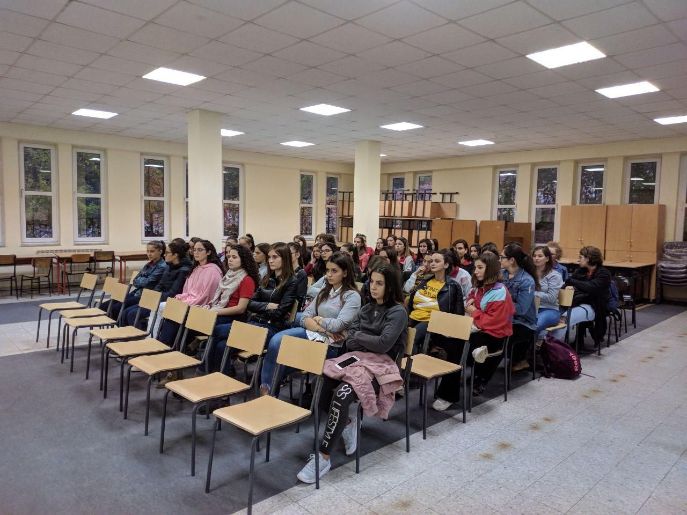
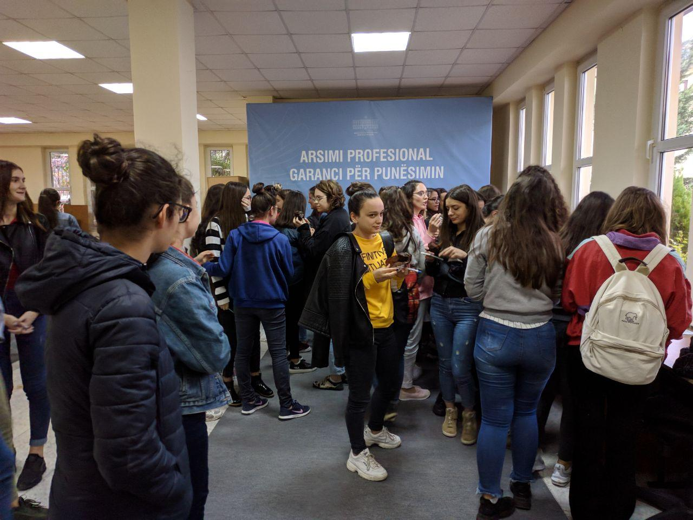
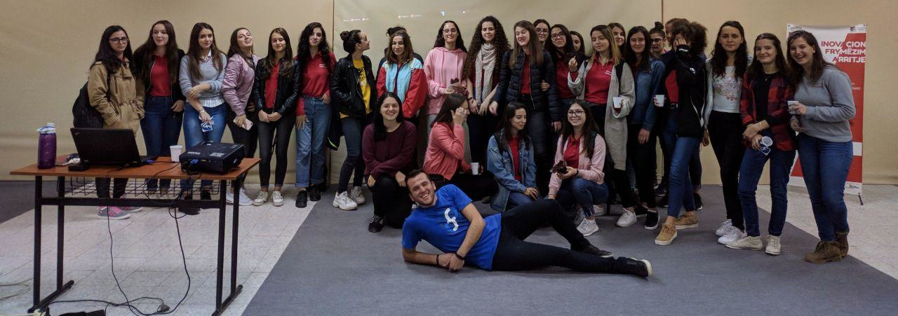

As every year, the Fedora Diversity Team decided to organize the [Fedora Women's Day](https://fedoraproject.org/wiki/Category:Fedora_Women's_Day) event, an event that also happened in Tirana, Albania. The official day for that would be around mid September, but unfortunately being an organizer of the [LibreOffice Conference](https://libocon.org/2018) too, things got a bit out of hand and the event was postponed until the 30th of October 2018. 

There were three of us (Ambassadors) that decided to organize this event, at the ["Hermann Gmeiner"](http://hermanngmeiner.vet.al/) technical high school in Tirana.
[Mariana](https://marianaballa.com) couldn't make it because she was in Taiwan for the [OpenTechFund](https://www.opentech.fund/) Summit, so only [Jona](https://jona.azizaj.com) and I ran the event.

The event started at 11:30 AM at the auditorium of the high school. The participants were ALL girls, a whole 58 of them to be exact. They were eager to learn about the Fedora Project and how to get involved and contribute in open source.

Jona started by introducing us to the participants and where we came from, about [Open Labs](https://openlabs.cc) as the root origin from where the Albanian Fedora community was born in, about Fedora and other projects that strongly cooperate with it etc.

The participants had questions and we were more than happy to answer those. Most of them hadn't heard about [Linux](https://en.wikipedia.org/wiki/Linux_kernel) before or used it, so this was a good opportunity for me to start from zero and explain Linux and distros with an easy terminology, so beginners could also understand it.

After, Jona explained more about the Fedora Women's Day and the Diversity & Inclusion Team in Fedora, some initiatives that the girls could participate in, such as [Google Summer of Code](https://summerofcode.withgoogle.com/), [Google Code-In](https://codein.withgoogle.com/), [Rails Girls Summer of Code](https://railsgirlssummerofcode.org/), [Outreachy](https://www.outreachy.org/) etc.

As if we were approaching the end of the event (about 2 hours in total), I prepared the food (delicious muffins 🍩) and drinks 🥤 for the participants, and of course, the swag table, where the girls could take some stickers and spread the love for Fedora ❤️.

Everyone got a muffin and discussed a few minutes in groups with each other 👩‍💻 about the event and we asked a few questions some students had.

To wrap up the event, as always, we had a group photo 📸 (not everyone was there, they were shy). Funnily enough, I was the only guy in a room full of girls, haha.

All in all, it was a successful event and we'll try to organize more in the upcoming future.

All content is licensed under CC BY-NC-SA 4.0. ([Attribution-NonCommercial-ShareAlike 4.0 International](https://creativecommons.org/licenses/by-nc-sa/4.0/)).
